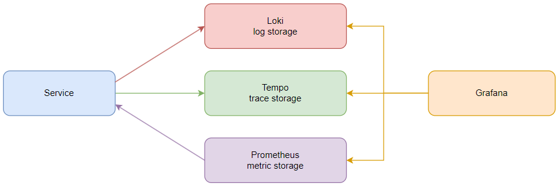
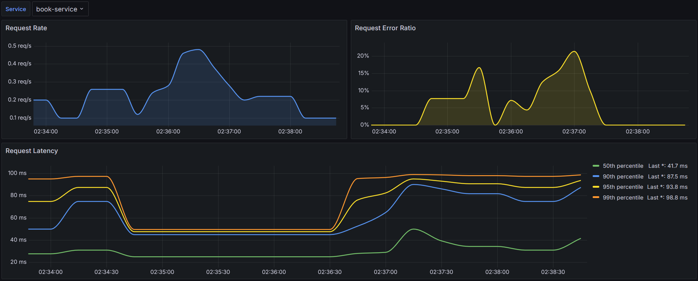

## Observability



#### Logging
Logger - kotlin-logging facade + Logback (default in Spring).<br/>
Service pushes structured logs to `http://localhost:3100/loki/api/v1/push` with loki-logback-appender.

#### Tracing
Service is instrumented with Micrometer Tracing to collect spans.<br/>
Micrometer Tracing comes with spring-boot-starter-actuator.<br/>
Micrometer Tracing uses Brave (OpenZipkin) to collect and send spans.<br/>
Service pushes spans to `http://localhost:9411/api/v2/spans`

#### Metrics
Service is instrumented with Micrometer to collect metrics.<br/>
Micrometer comes with spring-boot-starter-actuator.<br/>
Service provides metrics in Prometheus format with micrometer-registry-prometheus.<br/>
Prometheus scrapes metrics from `<service url>/actuator/prometheus`

### RED Monitoring



1. Rate
```
sum(rate(http_server_requests_seconds_count{job="book-service"}[1m]))
```
2. Errors
```
sum by (job) (rate(http_server_requests_seconds_count{status!~"2..|3..",job="book-service"}[1m]))
/
sum by (job) (rate(http_server_requests_seconds_count{job="book-service"}[1m])) * 100
```
3. Duration
```
# 50th percentile
histogram_quantile(0.5, sum by (le) (rate(http_server_requests_seconds_bucket{job="book-service"}[1m])))

# 95th percentile
histogram_quantile(0.95, sum by (le) (rate(http_server_requests_seconds_bucket{job="book-service"}[1m])))
```