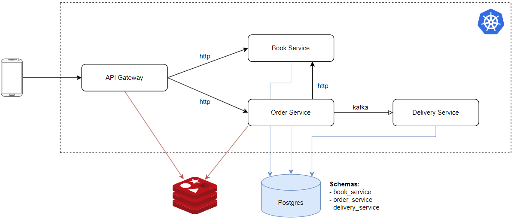

# online-shop-demo

Demo application for experiments



### Run application locally
1. Set up infrastructure
```bash
docker-compose --project-directory ./02-infra up -d
```
2. Build libraries
```bash
./gradlew publishToMavenLocal -p ./05-libraries/online-shop-model
./gradlew publishToMavenLocal -p ./05-libraries/adapters
```
3. Run services
```bash
./gradlew bootRun -p ./04-services/api-gateway
./gradlew bootRun -p ./04-services/book-service
./gradlew bootRun -p ./04-services/order-service
./gradlew bootRun -p ./04-services/delivery-service
```

### Configuration
- [Kubernetes](01-docs/Kubernetes.md)
- [Observability](01-docs/Observability.md)
- [Resilience](01-docs/Resilience.md)
- [Security](01-docs/Security.md)
- [Storage](01-docs/Storage.md)

### Local URLs

#### Infra
- [Kafka](http://localhost:9095)
- [Redis](http://localhost:8001)
- [Prometheus](http://localhost:9090)
- [Alertmanager](http://localhost:9093)
- [Smtp4dev](http://localhost:5000)
- [Grafana](http://localhost:3000)

#### Swagger
- [book-service](http://localhost:8090/swagger-ui/index.html)
- [order-service](http://localhost:8091/swagger-ui/index.html)