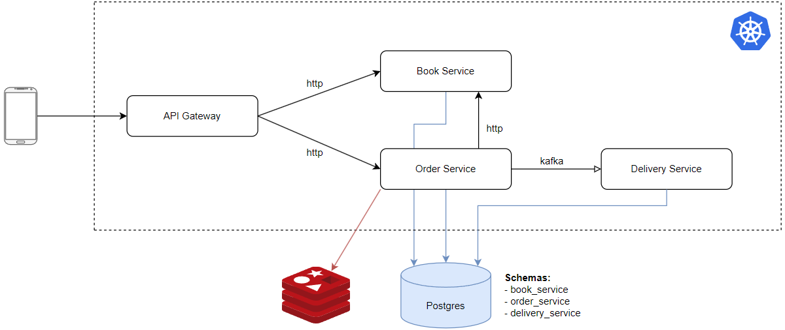
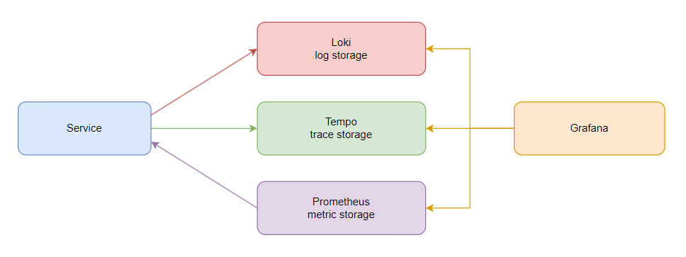

# online-shop-demo

Demo application for experiments



### Run application locally
1. Start local infra
```bash
cd 02-infra
docker-compose up -d
```
2. Run services
```bash
cd book-service
./gradlew bootRun
```

### Kubernetes
1. Build native image with GraalVM for JDK 21
```bash
cd book-service
./gradlew bootBuildImage
```
2. Push image to Docker Hub
```bash
docker push ysavchen/book-service:1.0.0
```
3. Start Kubernetes with profile name 'local-cluster'
```bash
minikube start --driver=docker --container-runtime=containerd --nodes 3 -p local-cluster
```
4. Apply manifests
```
kubectl apply -f deployment.yaml
```
5. Set namespace to online-shop-demo
```bash
kubectl config set-context --current --namespace=online-shop-demo
```
6. Set up Nginx Ingress
```
minikube addons enable ingress -p local-cluster
kubectl apply -f ingress.yaml
minikube tunnel -p local-cluster
```
7. Stop Kubernetes
```bash
minikube stop -p local-cluster
```

### Observability

#### Logging
Service -> Loki -> Grafana

Logger - kotlin-logging facade + Logback (default in Spring).<br/>
Service pushes structured logs to `http://localhost:3100/loki/api/v1/push` with loki-logback-appender.

#### Tracing
Service -> Tempo -> Grafana

Service is instrumented with Micrometer Tracing to collect spans.<br/>
Micrometer Tracing comes with spring-boot-starter-actuator.<br/>
Micrometer Tracing uses Brave (OpenZipkin) by default to collect and send spans.<br/>
Micrometer support for OpenTelemetry is not stable yet.<br/>
Service pushes spans to `http://localhost:9411/api/v2/spans`

#### Metrics
Service -> Prometheus -> Grafana

Service is instrumented with Micrometer to collect metrics.<br/>
Micrometer is an instrumentation library which can provide metrics for different observability systems.<br/>
Micrometer comes with spring-boot-starter-actuator.<br/>
Service provides metrics in Prometheus format with dependency micrometer-registry-prometheus.<br/>
Prometheus scrapes metrics from `<service url>/actuator/prometheus`



### Infrastructure
- Kafka UI: http://localhost:9095
- Prometheus: http://localhost:9090
- Alertmanager: http://localhost:9093
- Maildev: http://localhost:9094
- Grafana: http://localhost:3000

### Swagger
- book-service: http://localhost:8090/swagger-ui/index.html
- order-service: http://localhost:8091/swagger-ui/index.html