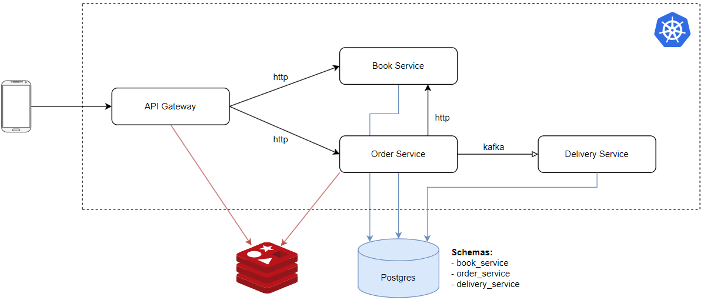

# online-shop-demo

Demo application for experiments



### Run application locally
1. Set up infrastructure
```bash
cd 02-infra
docker-compose up -d
```
2. Run services
```bash
cd 04-services/book-service
./gradlew bootRun
```

### Configuration
- [Kubernetes](01-docs/Kubernetes.md)
- [Observability](01-docs/Observability.md)

### Local URLs

#### Infra
- [Kafka UI](http://localhost:9095)
- [Prometheus](http://localhost:9090)
- [Alertmanager](http://localhost:9093)
- [Smtp4dev](http://localhost:5000)
- [Grafana](http://localhost:3000)

#### Swagger
- [book-service](http://localhost:8090/swagger-ui/index.html)
- [order-service](http://localhost:8091/swagger-ui/index.html)